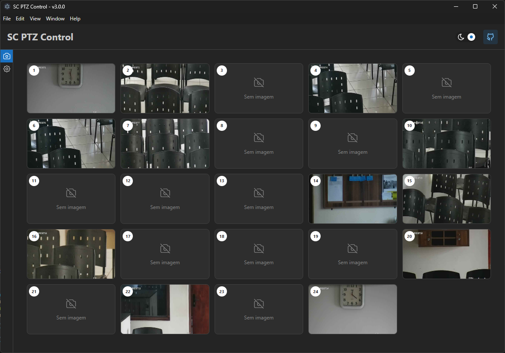

# SC - PTZ Control 🏗️

> App Electron para controlar câmeras PTZ de DVR/NVR Intelbras, feito para ajudar minha
> congregação de língua de sinais durante as reuniões.

---

<div align="center">
   
   
   
   
   
</div>

---



## O que faz

- **Imagem ao vivo** do canal, com latência de aproximadamente um quadro
- **Controle PTZ completo**: cruzeta de 8 direções, zoom, foco, íris e velocidade 1–8
- **Presets** com nome e miniatura: ir, gravar a posição atual, renomear e excluir do equipamento
- **Captura automática** de miniaturas de todos os presets
- **Mapa do salão**: arrastar presets para as cadeiras do auditório

## Requisitos

- **Windows x64.** O NetSDK da Intelbras é nativo 64-bit e só existe para Windows.
- **.NET 8 SDK** para compilar o serviço em C# (o instalador já sai self-contained).
- **O SDK da Intelbras** (`NetSDK 3.050`), que não é versionado neste repositório.

O projeto espera estar dentro do monorepo `ls-brasil-monorepo`, onde existe a pasta `helpers/`
com o SDK. Fora dele, informe o caminho na hora de compilar:

```powershell
dotnet build native/PtzBridge -p:NetSdkRoot="C:\caminho\para\...190304"
```

O erro `NetSDK não encontrado` significa que o SDK está ausente, não que o código quebrou.

## Como rodar

```powershell
pnpm install
pnpm build:bridge   # compila o serviço C# (só na primeira vez ou quando ele mudar)
pnpm dev            # sobe o Vite + Electron; o serviço é iniciado automaticamente
```

Na primeira execução, vá em **Configurações** e informe IP, porta (**37777**, a do SDK — não a 80
da interface web), usuário, senha e canal. A senha é guardada cifrada pelo Windows (DPAPI).

## Como gerar o instalador

```powershell
pnpm dist   # -> out/
```

## Arquitetura

O app fala com o NVR pelo **protocolo privado Dahua/Intelbras via NetSDK nativo**, não pela API
HTTP CGI. É o que permite PTZ com velocidade em todos os eixos e vídeo H.264 decodificado
localmente — coisas que o CGI não entrega.

```
Electron main ──spawn──► PtzBridge.exe (C# / .NET 8 / NetSDK)
                          │  escuta em 127.0.0.1, protegido por token
                          ├─ /ws/control          comandos e eventos (JSON)
                          ├─ /ws/video?channel=N  frames NV12 (binário)
                          └─ /api/thumb/{ch}/{n}  miniaturas dos presets
                                    ▲
                       React 19 + Mantine 9 (renderer)
```

O serviço em C# é o único que fala com o equipamento e é o dono da configuração e das
miniaturas (`%APPDATA%/sc-ptz-control`). O renderer não tem acesso à rede do NVR.

Detalhes de implementação estão em [CLAUDE.md](./CLAUDE.md).

## Help

- [@saulotarsobc](https://github.com/saulotarsobc)
  - [Template - SC Electron Boilerplate](https://github.com/saulotarsobc/sc-electron-boilerplate)
- [Intelbras](https://www.intelbras.com/pt-br/)
  - NetSDK 3.050 / PlaySDK 3.042 (SDK nativo — é o que o app usa)
  - HTTP_API_V3.35_Intelbras (a API antiga, não é mais usada)
  - [URL RTSP - Intelbras Forum](https://forum.intelbras.com.br/viewtopic.php?t=56068)
